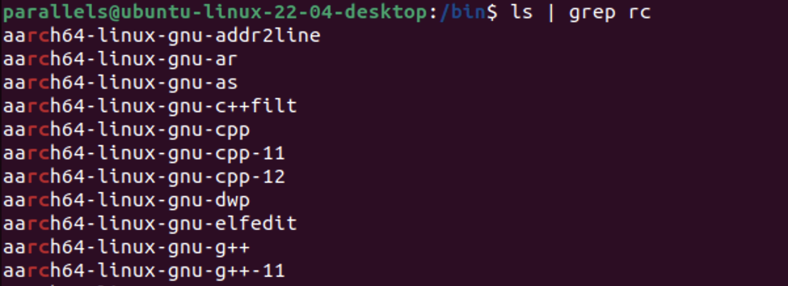

# 1⃣ grep command

\`**grep - global regular expression print\`**

* Searches for particular string/keyword from a file and print lines matching a pattern
* Checks line by line and print lines matching a pattern

Sample file

.png>)

1. `grep [pattern] [filename]`

.png>)

2. `grep -i “keyword” filename` → Ignore case of the pattern

.png>)

3.  `grep -v “keyword” filename` → Show all records except the pattern

    <figure><figcaption></figcaption></figure>
4. `grep -c “keyword” file` → count number of lines in which word is present

<figure><figcaption></figcaption></figure>

3. **`grep -w “keyword” file`** → exact match of a word

.png>)

6. **`grep -n “keyword” file`** → also prints the line number

<figure><figcaption></figcaption></figure>

7. **`grep “keyword” file1 file2 file3 ……`** → search in multiple files

<figure><figcaption></figcaption></figure>

8. **`grep -e “keyword” -e “keyword” -e “keyword” file`** → search for multiple keywords in a file

<figure><figcaption></figcaption></figure>

9. **`grep -e “keyword” -e “keyword” -e “keyword” file1 file2 …..`** → similarly to search for multiple keywords in multiple files
10. **`grep -l “keyword” file1 file2 file3`**` ``…..` → only get file name in which the word is present

.png>)

11. **`grep “^keyword” file`** → print matching line which starts from matching keyword

    <figure><figcaption></figcaption></figure>
12. **`grep “keyword$” file`** → print matching line that ends with given word

    <figure><figcaption></figcaption></figure>
13. **`grep -R “keyword” file`** → find in every file in a directory recursively

14. **`egrep “key1|key2|key3” filename`** → search multiple keywords

15. **`grep -q “keyword” filename` -** search but don't print on terminal

    <figure><figcaption></figcaption></figure>

Check the status by echo $? → exit status

16. **`grep -s “keyword” filename` →** suppress errors
17. **Use to search files → `ls | grep rc`**

