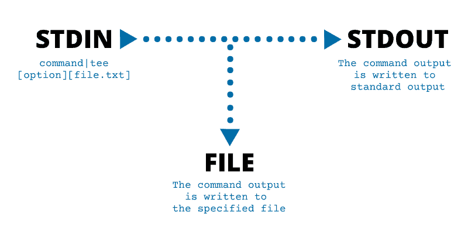

# 3⃣ Pipe in Linux

\-> The output of one commad redirect it to the input of other command

<figure><figcaption></figcaption></figure>

## Pipe syntax

We use '|' symbol to separate two commands. Output of first command passed to second command

```
command1 | command2
```

<figure><figcaption></figcaption></figure>

<figure><figcaption></figcaption></figure>

## Q1. Find number of files in a directory

```sh
ls -1 | wc -l
```

### Breakdown of the command used above

```sh
ls -1 
```

The command lists all files in a directory in a single column i.e. a single line represents name of one file.

<figure><figcaption><p>Output of ls command</p></figcaption></figure>

```sh
wc -l
```

This prints the number lines in file. Together the commands will print the number of files in a directory.

<figure><figcaption></figcaption></figure>

## Q2. Combine two files and sort them

Combining 2 files using cat command and then sorting them using pipe

```sh
cat file1.txt file2.txt | sort
```

<figure><figcaption></figcaption></figure>

<figure><figcaption><p>sorted output of concatenation of two files</p></figcaption></figure>


## Q3. Unique names in a file


```sh
cat file3.txt | sort | uniq
```


We can only use `uniq` command with sorted data only

<figure><figcaption></figcaption></figure>

<figure><figcaption></figcaption></figure>


## Q4. See 30-37 lines in a file

`head -37` to view first 37 lines , `tail -7` to view last 7 lines from the 37 lines, which makes 30-37

<figure><figcaption></figcaption></figure>

## Tee command -&#x20;

`tee` command reads from _**stdin**_ and saves the content to a file and also displays it to _**stdout**_

<figure><figcaption></figcaption></figure>

<figure><figcaption><p>writes and displays output of the ls command</p></figcaption></figure>
